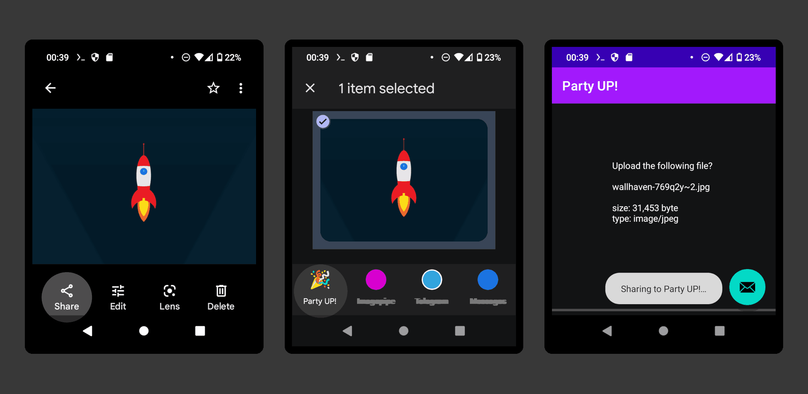

# Party UP!

<a href="https://f-droid.org/packages/me.ocv.partyup/"> '' </a> '' <a href="https://github.com/9001/party-up"></a>

upload files and links to a [copyparty](https://github.com/9001/copyparty) server by sharing them to this app

primarily made for this year's meadup, letting a room full of nerds throw memes onto the big screen

only the PUT API is implemented for now so there is no resumable uploads yet


## basic usage



* install the app
* open it and set your server url (and password if applicable)

now all share buttons in other apps/browsers will have "Party UP!" as an option, letting you upload pics / vids / twitter links / anything really


## the full experience

setup a raspberry pi (raspbian or something else with a desktop) with the [very-bad-idea](https://github.com/9001/copyparty/blob/hovudstraum/bin/mtag/very-bad-idea.py) plugin:

```bash
sudo apt install xdotool wmctrl libnotify-bin
curl -LO https://github.com/9001/copyparty/releases/latest/download/copyparty-sfx.py
curl -LO https://raw.githubusercontent.com/9001/copyparty/hovudstraum/bin/mtag/very-bad-idea.py
python3 copyparty-sfx.py --urlform save,get -v.::rw:c,e2d,e2t,mte=+a1:c,mtp=a1=ad,very-bad-idea.py
```

now, every time someone uploads something, it'll appear on the screen
* there is no queue system, it just goes

check the startup script in the very-bad-idea docstring for some bonus features,
* display a QR-code on the screen which takes people to the upload page
* make chrome autoplay audio on all pages

also [twitter-unmute.user.js](https://github.com/9001/copyparty/blob/hovudstraum/bin/mtag/res/twitter-unmute.user.js) to play twitter links with audio
